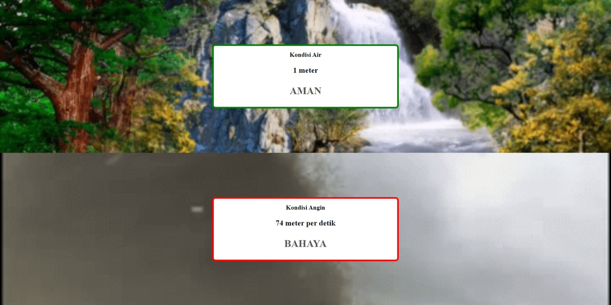

# Digitalent Kominfo Golang 004 - Assignment 3

> This is a microservice that updates the JSON file in every 15 seconds.

## 🧰 Installation

1. Clone the repository

```bash
git clone -b assignment-3 https://github.com/alifdwt/digitalent-golang.git
```

2. Run the application

```bash
go run main.go
```

3. Open http://localhost:8080 in your browser

## 📝 Documentation

### Get Water and Wind Status

```bash
go run main.go
```

Result:

```bash
Server started at http://localhost:8080
Status updated successfully!
|| Water: 97m                   || Wind: 28m/s                  ||
|| Water condition: bahaya      || Wind condition: bahaya       ||

Status updated successfully!
|| Water: 30m                   || Wind: 83m/s                  ||
|| Water condition: bahaya      || Wind condition: bahaya       ||

Status updated successfully!
|| Water: 92m                   || Wind: 53m/s                  ||
|| Water condition: bahaya      || Wind condition: bahaya       ||
```

status.json result:

```json
{
  "status": {
    "water": 92,
    "wind": 53
  }
}
```

## 📝 Status Page


