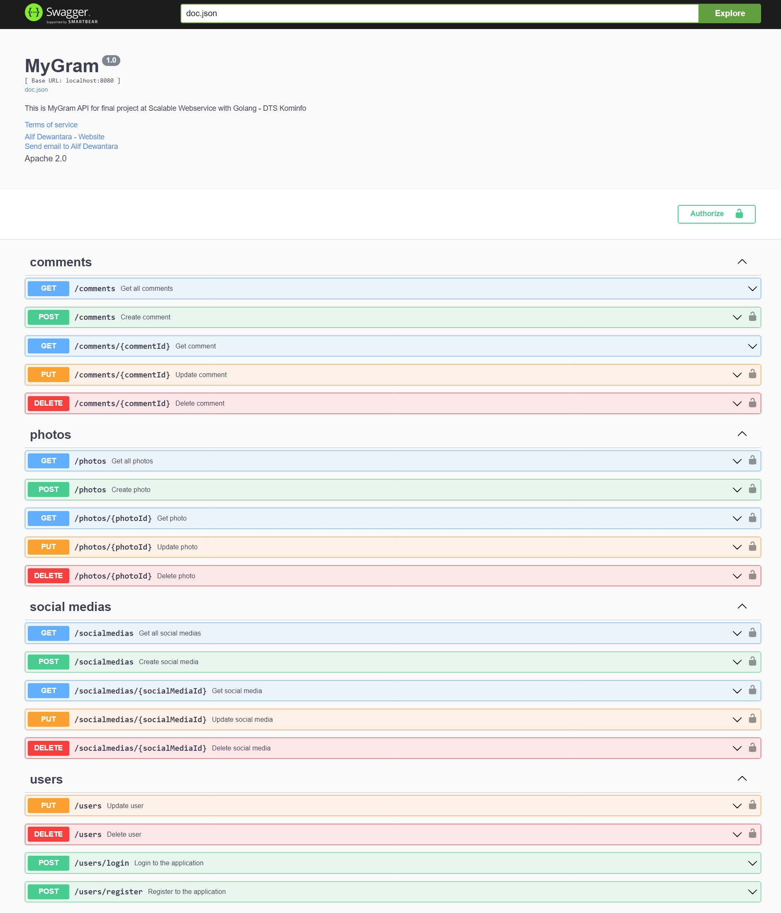
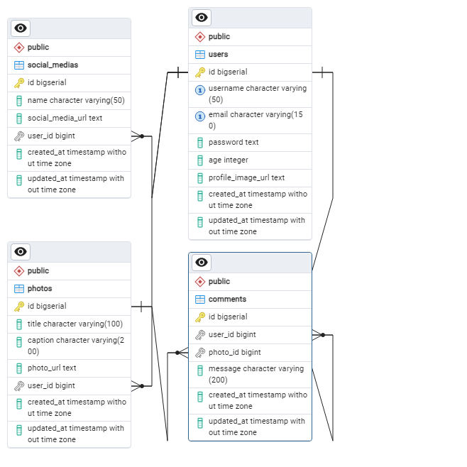

# Digitalent Kominfo Golang 004 - Final Project

> This is an API for final project at Scalable Webservice with Golang - DTS Kominfo called MyGram. Users can register, login, and upload photos. Users can also comment and share their social media.

## 🚀 Requirements

- Go v1.17 or higher
- PostgreSQL

## 🧰 Installation

1. Clone the repository

```bash
git clone https://github.com/alifdwt/digitalent-golang.git
```

2. Change directory

```bash
cd digitalent-golang
```

3. Install dependencies

```bash
go mod download
```

4. Run the application

```bash
go run main.go
```

5. App will be available at http://localhost:8080

## 📖 Documentation

You can find the documentation at http://localhost:8080/docs/index.html

## 📸 Screenshots



